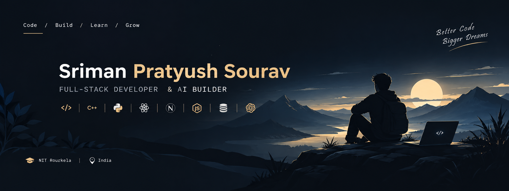
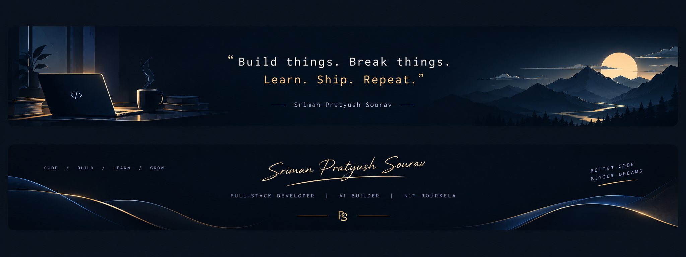

<!-- ===================================================== -->

<!--                     HEADER IMAGE                      -->

<!-- ===================================================== -->

  

 

<!-- ===================================================== -->

<!--                       INTRO                           -->

<!-- ===================================================== -->

<h1 align="center">Hey 👋, I'm Sriman Pratyush Sourav</h1>

  

  
  &nbsp;
  
  &nbsp;
  

  
  &nbsp;
  
  &nbsp;
  

 

---

<!-- ===================================================== -->

<!--                      ABOUT ME                         -->

<!-- ===================================================== -->

<h2 align="center">⚡ About Me</h2>

  I'm a <b>Full-Stack Developer</b> and Electrical Engineering graduate from
  <b>NIT Rourkela</b>, interested in building software at the intersection of
  <b>AI, web technologies, and backend engineering.</b>

  I enjoy turning ideas into complete products —
  from <b>architecture and APIs</b> to <b>interfaces, AI workflows, databases,
  and deployment.</b>

  Previously worked as a <b>Software Engineering Intern at Fractal Analytics</b>,
  contributing to AI applications, dashboard development, FastAPI services,
  model workflows, testing, deployment, and CI/CD.

 

  
  &nbsp;
  
  &nbsp;
  

 

---

<!-- ===================================================== -->

<!--                    EXPERIENCE                         -->

<!-- ===================================================== -->

<h2 align="center">💼 Experience</h2>

  <b>Fractal Analytics</b>
   
  Software Engineering Intern · Bangalore, India
   
  <i>May 2025 — July 2025</i>

 

  Developed a UI-based dashboard builder for configuring, testing, and
  deploying machine learning models, streamlining end-to-end workflows.

  Engineered a multi-agentic framework for an AI application and built
  scalable FastAPI API layers for integrating model services with
  application workflows.

  Automated testing and deployment through CI/CD pipelines, improving
  release reliability and reducing manual deployment effort.

 

---

<!-- ===================================================== -->

<!--                     PROJECTS                          -->

<!-- ===================================================== -->

<h2 align="center">🚀 Things I've Built</h2>

 

<table width="100%">
<tr>

<td width="50%" valign="top" align="center">

<h3>🤖 ClarityMeet</h3>

<b>AI Meeting Intelligence SaaS</b>

Transforms meeting transcripts into structured summaries, decisions,
action items, risks, and follow-ups.

<code>Next.js</code> · <code>TypeScript</code> ·
<code>PostgreSQL</code> · <code>OpenAI</code>

 

 

</td>

<td width="50%" valign="top" align="center">

<h3>🔎 CodeLens AI</h3>

<b>AI-Powered Code Review Platform</b>

AI-assisted code analysis for explanations, bug detection,
optimization suggestions, and complexity analysis.

<code>Next.js</code> · <code>TypeScript</code> ·
<code>OpenAI</code> · <code>Monaco Editor</code>

 

 

</td>

</tr>

<tr>

<td width="50%" valign="top" align="center">

<h3>📚 Library Management System</h3>

<b>Full-Stack Library Platform</b>

Platform for managing books, users, inventory, availability,
borrowing records, and library operations.

<code>Next.js</code> · <code>TypeScript</code> ·
<code>PostgreSQL</code> · <code>Prisma</code>

 

</td>

<td width="50%" valign="top" align="center">

<h3>🌐 LinguaGenie</h3>

<b>AI-Powered Universal Translator</b>

Real-time multilingual communication platform with streaming
text, voice support, and AI-powered translation.

<code>MERN</code> · <code>Socket.io</code> ·
<code>Groq LLM</code> · <code>Speech Recognition</code>

 

 

</td>

</tr>
</table>

 

---

<!-- ===================================================== -->

<!--                    TECH STACK                         -->

<!-- ===================================================== -->

<h2 align="center">🛠️ Tech Stack</h2>

<h3 align="center">Languages</h3>

  

<h3 align="center">Frontend</h3>

  

<h3 align="center">Backend & Databases</h3>

  

<h3 align="center">AI / LLM</h3>

<h3 align="center">Tools</h3>

  

 

---

<!-- ===================================================== -->

<!--                  COMPUTER SCIENCE                     -->

<!-- ===================================================== -->

<h2 align="center">🧠 Core Computer Science</h2>

 

---

<!-- ===================================================== -->

<!--                  PROBLEM SOLVING                      -->

<!-- ===================================================== -->

<h2 align="center">⚔️ Problem Solving</h2>

  <i>
    Learning algorithms, solving problems, and getting a little better
    with every contest.
  </i>

 

  

 

 

---

<!-- ===================================================== -->

<!--                   GITHUB STATS                        -->

<!-- ===================================================== -->

<h2 align="center">📊 GitHub Analytics</h2>

 

  
  &nbsp;
  

 

  

 

---

<!-- ===================================================== -->

<!--                  CONTRIBUTION SNAKE                   -->

<!-- ===================================================== -->

<h2 align="center">🐍 Contribution Journey</h2>

  

 

---

<!-- ===================================================== -->

<!--                      EDUCATION                        -->

<!-- ===================================================== -->

<h2 align="center">🎓 Education</h2>

 

<table width="100%">

<tr>
<td width="70%">

<b>National Institute of Technology, Rourkela</b> 
B.Tech in Electrical Engineering

</td>

<td width="30%" align="right">

<b>2022 — 2026</b> 
CGPA: <b>7.74 / 10</b>

</td>
</tr>

<tr>
<td>

<b>Jawahar Navodaya Vidyalaya, Mundali</b> 
CBSE Class XII — Science Stream

</td>

<td align="right">

<b>2021</b> 
93%

</td>
</tr>

<tr>
<td>

<b>Jawahar Navodaya Vidyalaya, Mundali</b> 
CBSE Class X

</td>

<td align="right">

<b>2019</b> 
96.8%

</td>
</tr>

</table>

 

---

<!-- ===================================================== -->

<!--                    CONNECT                            -->

<!-- ===================================================== -->

<h2 align="center">🌐 Let's Connect</h2>

  <i>
    Interested in software engineering, AI, full-stack development,
    or building something cool? Let's talk.
  </i>

 

  

  

  

  

 

<!-- ===================================================== -->

<!--                     FOOTER IMAGE                      -->

<!-- ===================================================== -->

  

 

  <i>Build things. Break things. Learn. Ship. Repeat.</i>

  Thanks for stopping by ✨

